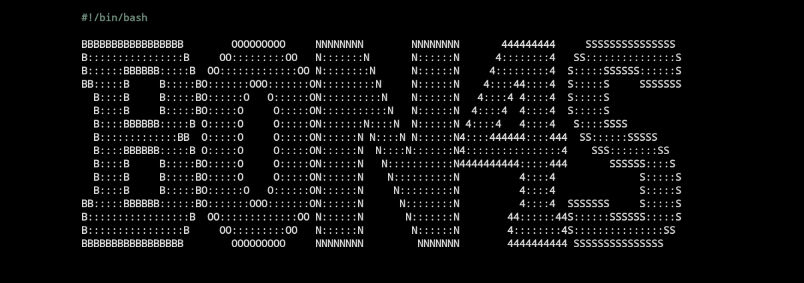
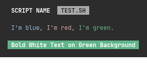
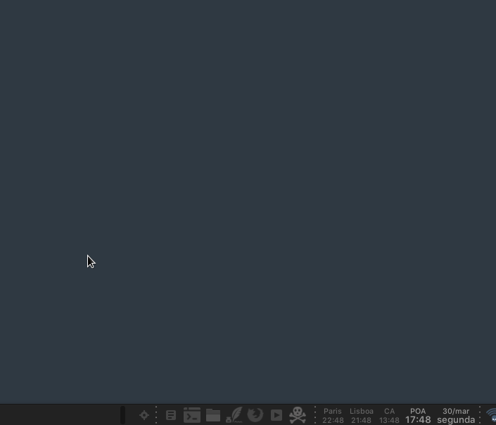
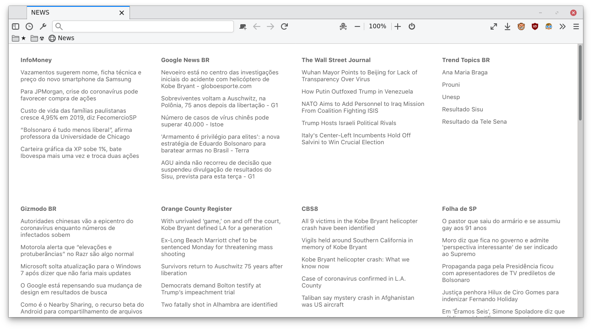
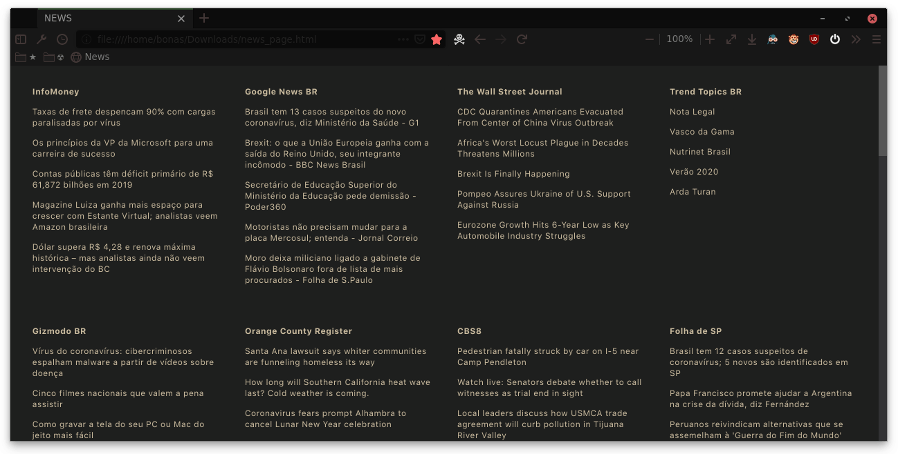
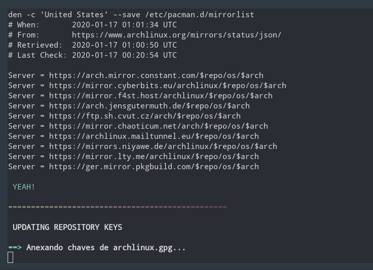
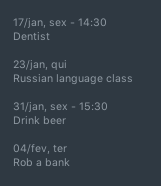

# My Cool Shells

| Shells created to make life easier. |  |
|-|-|

ENGLISH VERSION

Read this in another language: [Portuguese](readme.pt-BR.md)

Note: *English is not my first language, so if you see something wrong please correct me.*

--------

## *Table of Contents*

- [My Cool Shells](#my-cool-shells)
  - [*Table of Contents*](#table-of-contents)
  - [*What's all this?*](#whats-all-this)
  - [*FILE: header.sh*](#file-headersh)
  - [*FILE: news_page.sh*](#file-news_pagesh)
  - [*FILE: update_arch.sh*](#file-update_archsh)
  - [*FILE: google_calendar.sh*](#file-google_calendarsh)

--------

## *What's all this?*

I put here some of the shell scripts that I usually use.

Feel free to modify, improve and use as you wish.

To use, clone the repository, give permission and run:

```bash
git clone https://github.com/BON4S/MyCoolShells
cd MyCoolShells
chmod +x *.sh
./the_script.sh
```

Below is an explanation of some scripts.

--------

## *FILE: header.sh*

This is a basic code that I created to be used in all shell scripts as a common code. It serves to stylize the texts used in the scripts, creating clean and readable code, and is also useful for creating menus quickly in a different way.

To use this, just include the code in your script:

```bash
source "header.sh"
```

***TEXT STYLIZER***

With header.sh, we can style the text with variables and functions.

EXEMPLES

Without header.sh:

```bash
echo -ne "\e[1m\e[97m SCRIPT NAME \e[2m\e[37m\e[7m teste.sh \e[49m"

echo -e "\e[34m I'm blue,\e[33m I'm yellow,\e[32m I'm green."

echo -e "\e[107m\e[1m\e[31m Bold Red Text on White Background "
```

With header.sh:

```bash
Title "SCRIPT NAME"

echo -e "$blue I'm blue,$yellow I'm yellow,$green I'm green."

echo -e "$bg_white$bold$red Bold Red Text on White Background "
```



Both examples print exactly the same result.

NOTE: *See other color and style options inside header.sh.*

***MENU CREATOR***

With header.sh we can also create menus from functions with the ***FMenu*** command, or from lists with the ***LMenu*** command. See the examples below:



FUNCTION MENU

FMenu - Create menus from functions. To do this, simply create functions ending with "/menu":

```bash
The_menu_item/menu() {
  #commands
}
Another_item/menu() {
  #commands
}
FMenu
```

Result:

```txt
 1. The menu item
 2. Another item

 Nº
```

LIST MENU

LMenu - Create menus from lists, arrays, files... To do this, just set the list parameter and the action:

```bash
MenuAction() {                              # actions function
  echo "Your choice was: ${list[choice]}"   # the action
}
LMenu "$(ls /sys/class/net)"                # the list
```

Result:

```txt
In this example, your network interfaces will be listed as a menu:

 1. enp0s25
 2. lo
 3. virbr0
 4. virbr0-nic
 5. wlp0s26u1u2
 6. wlp3s0

 Nº
```

--------

## *FILE: news_page.sh*

This script extracts news from various websites and creates a lightweight html document.

LIGHT THEME (default)



DARK THEME (--dark)



Usage:

Insert your favorite news links (rss) into the script, and run it.

You can run the script without parameters, or you can specify the dark theme and directory to save the page, just like in these three examples:

```bash
./news_page.sh

./news_page.sh --dark

./news_page.sh -d /folder/to/save
```

*news_page.html* will be generated.

TIP 1: If you use Firefox, install my extension to get feed links easily: [Kill and More](https://github.com/BON4S/KillAndMore)

TIP 2: You can schedule the script to run every 3 hours by editing cron with the command:

```bash
export VISUAL=nano; crontab -e
```

and inside the edition insert a line like this:

```txt
0 */3 * * * /home/user/script_folder/news_page.sh --dark
```

--------

## *FILE: update_arch.sh*

This script is a good way to update the Arch Linux without errors during the process.



Usage:

```bash
./update_arch.sh
```

When we run the script it does the following sequence:

- Shows the latest Arch update news with the 'newsboat';
- Update antivirus - the unofficial ClamAV signatures;
- Clear Yay and Pacman's cache;
- Update mirrorlist with the 'reflector';
- Update repository keys;
- Update Arch official repository;
- Update the Flatpak;
- Update the Snap;
- Update the Arch User Repository (AUR);
- And finally, ask if you want to restart the system.

Dependencies: newsboat; ClamAV; unofficial ClamAV signatures script; reflector; Flatpak; Snap.

--------

## *FILE: google_calendar.sh*

This little script captures data from my Google Calendar via gcalcli.

I use it to print, with a simple and discreet result, my appointments on the desktop. I use Conky to show.



Usage:

```bash
./google_calendar.sh
```

To use this script it is necessary to install and configure gcalcli (activate the Google API).
