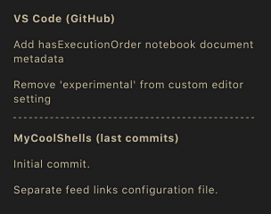

#

ENGLISH README - _English is not my first language, so if you see something wrong please correct me._

You can also read this in another language: [Portuguese](readme.pt-BR.md)

## My Cool Shells

I put here some of the shell scripts that I created and use (feel free to modify, improve and use as you wish).

To use, clone the repository, give permission and run:

```bash
git clone https://github.com/BON4S/MyCoolShells
cd MyCoolShells
chmod +x *.sh && chmod +x /news_page/*.sh && chmod +x /auto_commit/*.sh
./the_script.sh
```

Below I put screenshots and explanation of some scripts.

**CLICK BELOW TO EXPAND:**

<details>

<summary>🗗 news_page.sh</summary>

## _FILE: news_page.sh_

This script extracts news from various websites and creates a lightweight and practical html document.

The script also shows Twitter posts, GitHub feeds, YouTube feeds, currency quotes, weather and custom shell script outputs.

NEWS PAGE DARK THEME (running on [my Firefox theme](https://addons.mozilla.org/en-US/firefox/addon/focus-and-darkness/))


USAGE:

Insert your favorite news links (rss) in the settings file "**news_settings➜default.sh**" and run the script. You can run the script without parameters, or you can specify a custom settings file, as in the examples below:

```bash
# Without parameters:
./news_page.sh

# Specifying the settings file:
./news_page.sh -s news_settings➜Los_Angeles.sh
```

_news_page.html_ will be generated.

DEPENDENCIES:

- To use the Twitter function it is necessary to install: [pup](https://github.com/ericchiang/pup) (a HTML parser).

```bash
# Arch users (yay):
yay -S pup

# Users from other distros: Download the zipped executable from the link below and unzip it to the '/bin' folder.
# https://github.com/EricChiang/pup/releases/tag/v0.4.0
```

- To use the currency function it is necessary to install: [weather](http://fungi.yuggoth.org/weather/)

```bash
# Arch users (yay):
yay -S weather

# Debian and Ubuntu users:
sudo apt-get install weather-util
```

TIP 1:

If you use Firefox, install my extension to get feed links easily: [Kill and More](https://github.com/BON4S/KillAndMore)

TIP 2:

You can schedule the script to run every 12 hours by editing cron with the command:

```bash
export VISUAL=nano; crontab -e
```

and inside the edition insert a line like this:

```txt
0 */12 * * * /home/your_username/scripts_folder/news_page/news_page.sh -s news_settings➜Los_Angeles.sh
```

TIP 3:

You can get the main feed from your GitHub, to do this go to the homepage and copy the link where it says "Subscribe to your news feed". And put in your configuration file something like:

```text
feed2 "GitHub Main Feed" "https://github.com/BON4S.private.atom?token=QWERTYQWERTYQWERTY" "8"
```

In addition to the main feed you can also get project commits, as in the image below:



</details>

<details>

<summary>🗗 auto_commit.sh</summary>

## _FILE: auto_commit.sh_

The "auto_commit.sh" is a script that checks for changes in certain files through an md5 check. And when the change exists, the script sends the file, with a custom commit, to your repository on GitHub. I use this script to create automatic backups of [my dotfiles](https://github.com/BON4S/Dotfiles) (settings files). The script is also able to pick up files around the computer and keep an updated copy of them in a single folder. Everything in a simple and practical way.

USAGE

Edit the configuration file (auto_commit_config➜default.sh) and run the script:

```bash
./auto_commit.sh
```

With the "-s" parameter you can also specify a customized configuration file:

```bash
./auto_commit.sh -s auto_commit_config➜mysettings.sh
```

Important: It is necessary to create an [SSH Key from GitHub](https://help.github.com/en/github/authenticating-to-github/generating-a-new-ssh-key-and-adding-it-to-the-ssh-agent) on the machine so the script doesn't need a password.

SCHEDULE

Schedule the script to run every 12 hours. To do this, edit your distro's cron with the commands below:

```bash
# to open the cron edition:
export VISUAL=nano; crontab -e

# and insert a line like this:
0 */12 * * * /home/your_username/scripts_folder/auto_commit/auto_commit.sh
```

</details>

<details>

<summary>🗗 default.sh</summary>

## _FILE: default.sh_

This is a basic code that I created to be used in all shell scripts as a common code. This is useful to stylize texts, and to create menus quickly.

To use this, import default.sh at the beginning of your script code:

```bash
source "default.sh"
```

**_TEXT STYLIZER FEATURE_**

Without default.sh:

```bash
echo -ne "\e[1m\e[97m SCRIPT NAME \e[2m\e[37m\e[7m teste.sh \e[49m"

echo -e "\e[34m I'm blue,\e[33m I'm yellow,\e[32m I'm green."

echo -e "\e[107m\e[1m\e[31m Bold Red Text on White Background "
```

With default.sh:

```bash
title "SCRIPT NAME"

echo -e "$blue I'm blue,$yellow I'm yellow,$green I'm green."

echo -e "$bg_white$bold$red Bold Red Text on White Background "
```


Both examples print exactly the same result.

_See other color and style options inside the file default.sh._

**_MENU CREATOR FEATURE_**

With default.sh we can create menus from functions with the **_fmenu_** and **_fmenu2_** commands, or from lists with the **_lmenu_** and **_lmenu2_** commands. See the examples below:

FUNCTION MENU

fmenu - Create menus from functions. To do this, simply create functions ending with "/menu":

```bash
The_menu_item/menu() {
  #commands
}
Another_item/menu() {
  #commands
}
fmenu
```

Result:

```txt
 1. The menu item
 2. Another item

 Nº
```

LIST MENU

lmenu - Create menus from lists, arrays, files... To do this, just set the list parameter and the action:

```bash
action() {                                  # actions function
  echo "Your choice was: ${list[choice]}"   # the action
}
lmenu "$(ls /sys/class/net)"                # the list
```

Result:

```txt
In this example, your network interfaces will be listed as a menu:

 1. enp0s25
 2. lo
 3. virbr0
 4. virbr0-nic
 5. wlp0s26u1u2
 6. wlp3s0

 Nº
```

LIST AND FUNTION MENUS **2**

**fmenu2** and **lmenu2** do the same things as the previous ones, but they have support for the keyboard.

```text
⇩ down:             next item
⇧ up:               previous item
⇨ right or space:   choose the option
⇦ left or q:        quit
```


</details>

<details>

<summary>🗗 update_arch.sh</summary>

## _FILE: update_arch.sh_

This script is a good way to update the Arch Linux without errors during the process.


Usage:

```bash
./update_arch.sh
```

When we run the script it does the following sequence:

- Shows the latest Arch update news with the 'newsboat';
- Update antivirus - the unofficial ClamAV signatures;
- Clear Yay and Pacman's cache;
- Update mirrorlist with the 'reflector';
- Update repository keys;
- Update Arch official repository;
- Update the Flatpak;
- Update the Snap;
- Update the Arch User Repository (AUR);
- Update the pkgfile data;
- And finally, ask if you want to restart the system.

Dependencies: newsboat; ClamAV; unofficial ClamAV signatures script; Yay; reflector; Flatpak; Snap; pkgfile.

</details>

<details>

<summary>🗗 google_calendar.sh</summary>

## _FILE: google_calendar.sh_

This little script captures data from my Google Calendar via gcalcli.

I use it to print, with a simple and discreet result, my appointments on the desktop. I use Conky to show.


Usage:

```bash
./google_calendar.sh
```

To use this script it is necessary to install and configure gcalcli (activate the Google API).

</details>
