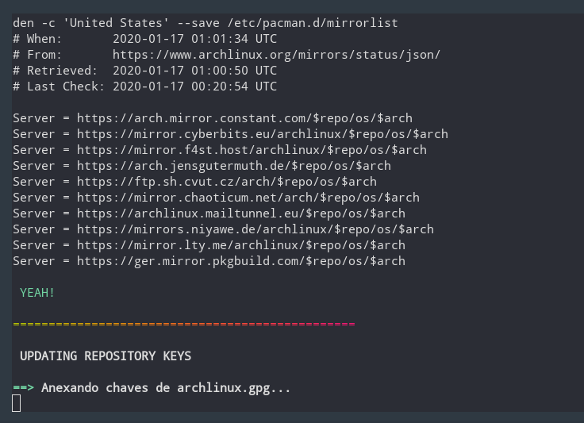

#

_You can also read this in another language: [Portuguese](readme.pt-BR.md)_

## My Cool Shells

> I put here some of the shell scripts that I created. To use the scripts, follow these 3 steps below.

```bash
# STEP 1
# CLONE THE REPOSITORY:
git clone https://github.com/BON4S/MyCoolShells

# STEP 2
# GIVE THE SCRIPTS EXECUTION PERMISSION:
cd MyCoolShells
chmod +x *.sh && chmod +x /news_page/*.sh && chmod +x /auto_commit/*.sh

# STEP 3
# RUN THE SCRIPT THAT YOU WANT:
./the_script.sh
```

### SCRIPTS:

> Below I put the explanation and images of some scripts. **CLICK TO EXPAND**

<details>

<summary>🗗 default.sh</summary>

## _🙼 default.sh_

This is a script I created to be used within all other shell scripts. This is useful to stylize texts, and to create menus quickly. To use this, import default.sh at the beginning of your script code:

```bash
source "default.sh"
```

**Examples and Features:**

**🔸 TEXT STYLIZER FEATURE**

```bash
# WITHOUT DEFAULT.SH
echo -ne "\e[1m\e[97m SCRIPT NAME \e[2m\e[37m\e[7m teste.sh \e[0m"
echo -e "\e[34m I'm blue,\e[31m I'm red,\e[32m I'm green."
echo -e "\e[42m\e[1m\e[97m Bold White Text on Green Background "
```

```bash
# WITH DAFAULT.SH
title "SCRIPT NAME"
echo -e "$blue I'm blue,$red I'm red,$green I'm green."
echo -e "$bg_green$bold$white Bold White Text on Green Background "
```

_Both examples print exactly the same result_


**🔸 MENU CREATOR FEATURE**

FUNCTION MENU (fmenu) - Create menus from functions. To do this, simply create functions ending with "/menu":

```bash
The_menu_item/menu() {
  #commands
}
Another_item/menu() {
  #commands
}
fmenu
```

```txt
# RESULT:
 1. The menu item
 2. Another item

 Nº
```

LIST MENU (lmenu) - Create menus from lists, arrays, files... To do this, just set the list parameter and the action:

```bash
action() {                                  # actions function
  echo "Your choice was: ${list[choice]}"   # the action
}
lmenu "$(ls /sys/class/net)"                # the list
```

```txt
# RESULT: In this example, your network interfaces will be listed as a menu.
 1. enp0s25
 2. lo
 3. virbr0
 4. virbr0-nic
 5. wlp0s26u1u2
 6. wlp3s0

 Nº
```

LIST AND FUNTION MENUS **2** (fmenu2 and lmenu2) - These do the same things as the previous ones, but have keyboard support.

```text
⇩ down:             next item
⇧ up:               previous item
⇨ right or space:   choose the option
⇦ left or q:        quit
```


---

</details>

<details>

<summary>🗗 update_arch.sh</summary>

## _🙼 update_arch.sh_

This script is an easy way to update Arch Linux.



Usage:

```bash
./update_arch.sh
```

When we run the script it does the following sequence:

- Shows the latest Arch update news with the 'newsboat';
- Update antivirus - the unofficial ClamAV signatures;
- Clear Paru and Pacman's cache;
- Update mirrorlist with the 'reflector';
- Update repository keys;
- Update Arch official repository;
- Update the Flatpak;
- Update the Snap;
- Update the Arch User Repository (AUR);
- Remove unneeded packages (orphans);
- And finally, ask if you want to restart the system.

Dependencies: newsboat; ClamAV; unofficial ClamAV signatures script; paru; reflector; flatpak; snap; trash.

---

</details>

<details>

<summary>🗗 docker.sh</summary>

## _🙼 docker.sh_

This is a script to view, start and stop Docker containers.

```bash
# Usage:
./docker.sh
```


---

</details>

<details>

<summary>🗗 google_calendar.sh</summary>

## _🙼 google_calendar.sh_

This little script captures data from Google Calendar via gcalcli and organizes it. I use this script with Conky, to print a simple and discreet result of my appointments on the desktop.


```bash
# Usage:
./google_calendar.sh
```

It is necessary to install and configure gcalcli.

---

</details>

> Below, no longer used (abandoned) scripts. **CLICK TO EXPAND**

<details>

<summary>🗗 news_page.sh</summary>

## _🙼 news_page.sh_

This script extracts news from websites and creates a lightweight and practical html document.

The script also shows Twitter posts, GitHub feeds, YouTube feeds, currency quotes, weather and custom shell script outputs.


USAGE:

Insert your favorite news links (feed rss) in the settings file "**news_settings➜default.sh**" and run the script. You can run the script without parameters, or you can specify a custom settings file, as in the examples below:

```bash
# Without parameters:
./news_page.sh

# Specifying the settings file:
./news_page.sh -s news_settings➜Los_Angeles_News.sh

# news_page.html will be generated.
```

DEPENDENCIES:

- To show Tweets it is necessary to install: [jq](https://stedolan.github.io/jq/) (a Json parser).

- To use to use weather data feature it is necessary to install: [weather](http://fungi.yuggoth.org/weather/)

```bash
# Arch users (paru):
paru -S weather

# Debian and Ubuntu users:
sudo apt-get install weather-util
```

TIP 1:

You can schedule the script to run every 12 hours by editing cron with the command:

```bash
export VISUAL=nano; crontab -e
```

and then insert a line like this:

```txt
0 */12 * * * /home/your_username/scripts_folder/news_page/news_page.sh -s news_settings➜Los_Angeles.sh
```

TIP 2:

You can get the main feed from your GitHub, to do this go to the homepage and copy the link where it says "Subscribe to your news feed". And put it in your configuration file:

```text
feed2 "GitHub Main Feed" "https://github.com/BON4S.private.atom?token=QWERTYQWERTYQWERTY" "8"
```

In addition to the main feed you can also get project commits, as in the image below:


---

</details>
